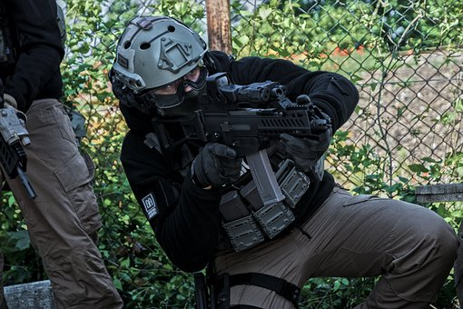

# Weapon-Detection-And-Classification-Using-Deep-Learning
Weapon Detection &amp; Classification through CCTV surveillance using Deep Learning-CNNs.

This dataset contains <b>10,014 images</b> that classifies 3 categories of weapons. The weapon categories
  included in this release are:   

  - <b> Knife </b>  
  - <b> Small Gun </b>  
  - <b> Long Gun</b>    
 
 <b>>>> DOWNLOAD, TRAINING AND PREDICTION: </b>   
 The datasets can be downloaded via the link provided in the **train** folder.   
 <b>>>> Prediction Results</b>   

<pre>
Knife  :  2.6346240e-04
Long Gun  :  9.1683286e-01
Small Gun :  8.2903586e-02
</pre>

 

<h3><b><u>References</u></b></h3>

 1. Olmos, R., Tabik, S., & Herrera, F. (2018). 
 <a href="https://sci2s.ugr.es/weapons-detection#SW" >https://sci2s.ugr.es/weapons-detection#SW</a>   
